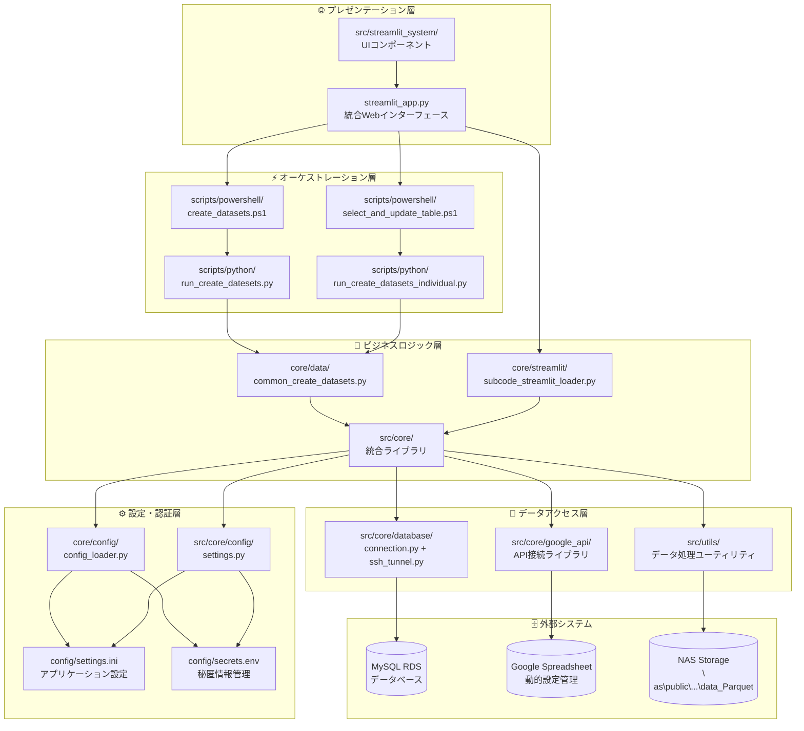

# システムアーキテクチャ仕様書

## 概要

塾ステ CSVダウンロードツール「ストミンくん」は、教育関連企業のデータ分析基盤として、Streamlit Webアプリケーションを中心とした統合システムです。

## システム全体構成



## 1. 定期バッチシステム

### 目的
BIツール・レポート生成用の元データ作成

### 構成要素

| ファイル | 役割 | 設定 |
|----------|------|------|
| `main.py` | 本番環境メインエントリー | main_sheet, 実行対象 |
| `main_test.py` | テスト環境エントリー | main_sheet, 実行対象 |
| `main_rawdata.py` | 生データ処理エントリー | rawdata_sheet, テスト実行 |
| `common_exe_functions.py` | 共通実行処理エンジン | - |

### データフロー
1. Googleスプレッドシートから実行対象SQLファイル一覧取得
2. Google DriveからSQLクエリファイル読み込み
3. MySQL（AWS RDS）からデータ抽出
4. CSV形式で外部保存先に出力
5. Google Spreadsheetに結果ログ記録

### 出力先
- CSV Files（外部ネットワークパス）
- Google Spreadsheet（実行ログ）

## 2. ストミン データソース システム

### 目的
Streamlit WebUI「ストミンくん」用のデータソース生成

### 構成要素

| ファイル | 役割 | 設定 |
|----------|------|------|
| `run_create_datesets.py` | メインエントリー | eachdata_sheet, 個別リスト |
| `run_create_datasets_individual.py` | 個別テーブル処理 | eachdata_sheet, 個別リスト |
| `common_create_datasets.py` | ストミン用処理エンジン | - |
| `streamlit_app.py` | WebUI フロントエンド | - |

### データフロー
1. Googleスプレッドシート「個別実行シート」から対象取得
2. MySQL（AWS RDS）からデータ抽出
3. データ型変換・日付フォーマット統一
4. Parquet形式で`data_Parquet/`に保存
5. Streamlit UIでリアルタイム表示

### 出力先
- Parquet Files（`data_Parquet/`ディレクトリ）
- Streamlit WebUI

## 3. 共通基盤

### データベース接続
- **MySQL RDS**: AWS上の本番データベース（読み取り専用）
- **SSH Tunnel**: セキュアな接続経路
- **接続管理**: `database_connection.py`, `ssh_connection.py`

### 外部サービス連携
- **Google Drive**: SQLクエリファイル管理
- **Google Spreadsheet**: 設定管理・実行ログ
- **認証**: サービスアカウント（JSON形式）

### 設定管理
- **config.ini**: 環境設定（SSH, DB, パス等）
- **config_loader.py**: 設定読み込み処理

### ログ管理
- **my_logging.py**: 統一ログシステム
- **RotatingFileHandler**: ログローテーション対応

## 4. 現在のデータセット

### Parquetファイル一覧（30個）
- 企業・教室・ブランド情報
- 応募者・候補者データ
- 求人・契約・請求データ
- オファー・キャンペーン情報
- 管理・分析用データ

## 5. 実行方法

### 定期バッチ
```bash
# PowerShell実行
.\run.ps1        # main.py実行
.\run_test.ps1   # main_test.py実行

# 直接実行
python main.py
python main_test.py
python main_rawdata.py
```

### ストミン データソース
```bash
# PowerShell実行（未実装）
python run_create_datesets.py
python run_create_datasets_individual.py

# Streamlit UI
streamlit run streamlit_app.py
```

## 6. 技術スタック

- **言語**: Python 3.x
- **DB**: MySQL（AWS RDS）
- **UI**: Streamlit
- **データ形式**: CSV, Parquet
- **認証**: Google API（OAuth 2.0）
- **インフラ**: AWS（RDS）
- **仮想環境**: venv

## 7. セキュリティ

- SSH トンネル経由でのDB接続
- Google API サービスアカウント認証
- 読み取り専用DBユーザー
- 秘密鍵・認証情報のローカル管理