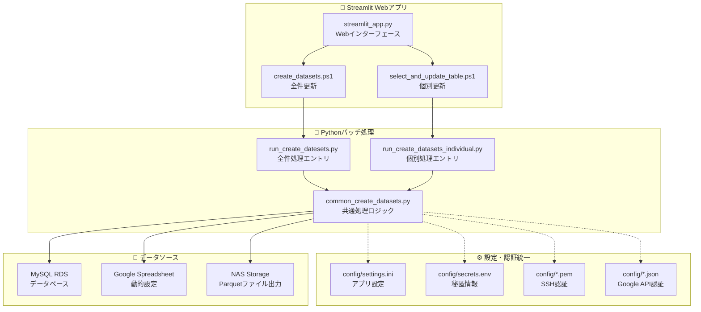

# 塾ステ CSVダウンロードツール「ストミンくん」仕様書

## 📚 ドキュメント構成

このディレクトリには、システムの全体仕様と保守性向上のためのガイドが含まれています。

### 📖 仕様書一覧

| ドキュメント | 概要 | 対象読者 |
|-------------|------|----------|
| [01_system_architecture.md](01_system_architecture.md) | システム全体のアーキテクチャと構成要素 | 全員 |
| [02_maintenance_improvement_guide.md](02_maintenance_improvement_guide.md) | 現在の課題と保守性向上の改善提案 | 開発者・PM |
| [03_deployment_operations_guide.md](03_deployment_operations_guide.md) | デプロイメント手順と運用ガイド | 運用担当者 |
| [04_developer_guide.md](04_developer_guide.md) | 開発者向けのコーディング規約とガイド | 開発者 |

## 🎯 プロジェクト概要

**塾ステ CSVダウンロードツール「ストミンくん」**は、教育関連企業のデータ分析基盤として、以下の機能を提供する統合システムです。

### 🎨 **Streamlit Webアプリケーション**
- **UI**: 直感的なWebインターフェース
- **機能**: 全件更新・個別テーブル更新
- **出力**: Parquet形式（NAS保存）
- **監視**: バックグラウンド実行＋完了通知

### 🔄 **バッチ処理システム**
- **全件更新**: 全テーブルの一括処理
- **個別更新**: 指定テーブルのみ処理
- **データソース**: Google Spreadsheet（動的設定）
- **認証**: 統一された`secrets.env`管理

## 🏗️ システム構成図



## 📊 技術スタック

- **言語**: Python 3.9+
- **WebUI**: Streamlit（シングルページアプリ）
- **データ形式**: Parquet（メイン）、CSV（互換）
- **設定管理**: `settings.ini` + `secrets.env`
- **外部サービス**: Google Sheets API（動的設定）
- **データベース**: MySQL（AWS RDS + SSH Tunnel）
- **実行環境**: PowerShell + Python
- **文字エンコーディング**: UTF-8統一

## 🚀 クイックスタート

### 1. セットアップ
```bash
# リポジトリクローン
git clone <repository-url>
cd GIG塾STMYSQL/sourcecode_dev

# 仮想環境作成・アクティベート
python -m venv venv
.\venv\Scripts\Activate.ps1

# 依存関係インストール
pip install -r requirements.txt
```

### 2. 設定ファイル配置
```bash
# 📁 config/settings.ini（基本設定）
[SSH]
host = your-ssh-host
user = your-user

[MySQL] 
host = your-db-host
port = 3306
user = your-db-user
database = your-database

[Spreadsheet]
spreadsheet_id = your-spreadsheet-id
main_sheet = 実行シート
eachdata_sheet = 個別実行シート

# 🔐 config/secrets.env（秘匿情報）
SSH_KEY_PATH=config/your-key.pem
MYSQL_PASSWORD=your-password
JSON_KEYFILE_PATH=config/your-service-account.json
```

### 3. 実行
```bash
# 🎨 Streamlit Webアプリ起動
streamlit run streamlit_app.py

# 🔄 PowerShellバッチ実行
.\scripts\powershell\create_datasets.ps1            # 全件更新
.\scripts\powershell\select_and_update_table.ps1   # 個別更新

# WebUI起動
streamlit run streamlit_app.py
```

## 🎛️ 主要機能

### 定期バッチシステム
- ✅ Google Spreadsheetからの設定読み込み
- ✅ Google DriveからのSQLファイル取得
- ✅ MySQL（AWS RDS）からのデータ抽出
- ✅ CSV形式での大容量データ出力
- ✅ 実行結果のログ管理
- ✅ Slack通知機能

### ストミン データソースシステム
- ✅ Parquet形式でのデータ保存
- ✅ データ型安全性の確保
- ✅ 高速データアクセス
- ✅ Streamlit WebUIでの可視化
- ✅ リアルタイムデータ更新

## 📈 現在のデータセット

**30個のParquetファイル**が`data_Parquet/`に格納されており、以下のデータを網羅：

- **企業データ**: 企業、教室、ブランド情報
- **人材データ**: 応募者、候補者、ユーザー情報  
- **業務データ**: 求人、契約、請求情報
- **マーケティング**: オファー、キャンペーン情報
- **分析用**: 集計済み・加工済みデータ

## ⚠️ 現在の課題

### 🔧 技術的課題
1. **巨大ファイル**: `subcode_loader.py`（1270行）の分割が必要
2. **設定管理**: 環境別設定の整理が必要
3. **テスト不足**: 単体テスト・統合テストの導入が必要
4. **エラーハンドリング**: 統一的な例外処理が必要

### 🏗️ アーキテクチャ課題
1. **コード重複**: 2システム間での処理重複
2. **依存関係**: モジュール間の結合度が高い
3. **ファイル構成**: 目的別の整理が不十分

## 🎯 改善ロードマップ

### Phase 1: 基盤整備（高優先度）
- [ ] ファイル構成の整理
- [ ] 設定管理の統一  
- [ ] エラーハンドリングの統一
- [ ] ログ管理の改善

### Phase 2: 品質向上（中優先度）
- [ ] テストコードの導入
- [ ] CI/CD パイプライン構築
- [ ] コードレビュープロセス確立

### Phase 3: 運用改善（低優先度）
- [ ] 監視・アラート機能強化
- [ ] データ品質管理導入
- [ ] パフォーマンス最適化

## 🤝 コントリビューション

### 開発に参加する前に
1. [04_developer_guide.md](04_developer_guide.md) を確認
2. 開発環境をセットアップ
3. コーディング規約を理解
4. テスト戦略を把握

### プルリクエスト手順
1. `develop`ブランチから機能ブランチを作成
2. 実装・テスト作成
3. コードレビュー依頼
4. マージ後のデプロイ確認

## 📞 サポート・連絡先

### 技術的な質問
- 開発者向けガイドを参照
- GitHubイシューで質問投稿

### 運用上の問題
- 運用ガイドのトラブルシューティングを参照
- Slack通知の確認

### 緊急時対応
- [03_deployment_operations_guide.md](03_deployment_operations_guide.md) の緊急時手順を参照

## 📝 変更履歴

### v1.0.0（現在）
- 定期バッチシステムの実装
- ストミン データソースシステムの実装
- Streamlit WebUIの実装
- BIダッシュボード機能の削除

### 今後の予定
- 保守性向上のリファクタリング
- テスト基盤の構築
- CI/CD パイプラインの導入

---

## 📄 ライセンス

このプロジェクトは社内利用のみを目的としています。

## 🔗 関連リンク

- [システムアーキテクチャ詳細](01_system_architecture.md)
- [保守性向上提案](02_maintenance_improvement_guide.md)  
- [運用ガイド](03_deployment_operations_guide.md)
- [開発者ガイド](04_developer_guide.md)